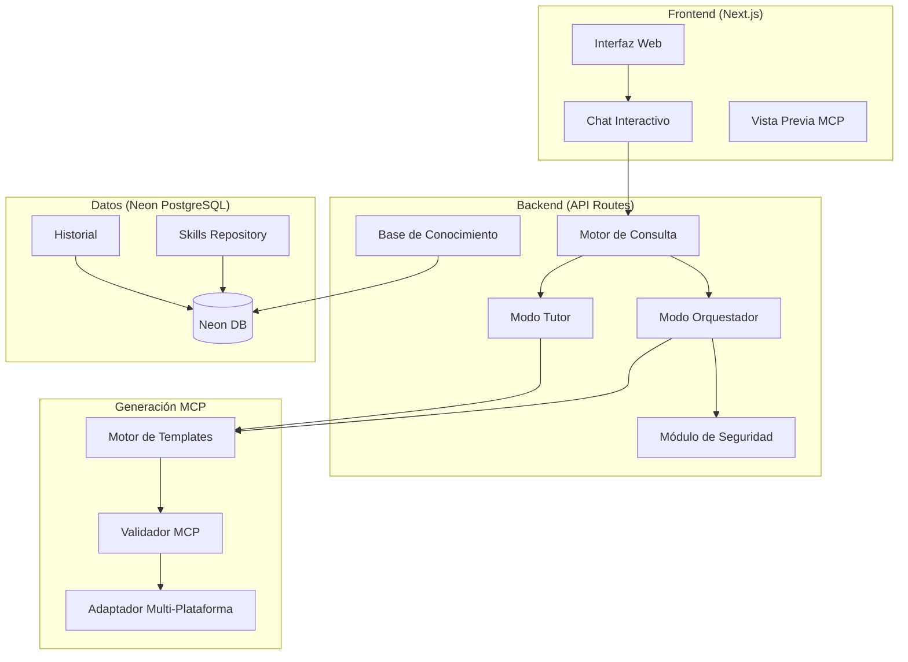

# MCP Builder - Arquitectura del Sistema

## Visión General

MCP Builder es una aplicación que asiste a usuarios en la creación de servidores MCP (Model Context Protocol) compatibles con múltiples plataformas: Claude Code, OpenAI Codex, OpenCode, Antigravity, y otros clientes MCP.

## Stack Tecnológico

| Capa | Tecnología | Justificación |
|------|-----------|---------------|
| **Frontend** | Next.js 14 (App Router) | SSR, API Routes, deploy en Vercel |
| **UI** | Tailwind CSS + shadcn/ui | Componentes accesibles y modernos |
| **Backend** | Next.js API Routes + tRPC | Type-safe end-to-end |
| **Base de Datos** | Neon PostgreSQL | Serverless, escalable, branching |
| **ORM** | Drizzle ORM | Type-safe, lightweight, edge-compatible |
| **Auth** | NextAuth.js | OAuth multi-proveedor |
| **MCP SDK** | @modelcontextprotocol/sdk | Generación y validación MCP |
| **Diagramas** | Mermaid.js | Compatible Google Docs/Word |
| **Deploy** | Vercel + Neon | Serverless, CDN global |

## Modos de Operación

### 🎯 Modo Orquestador
Genera MCPs completos y funcionales de forma automatizada:
1. Consulta al usuario el objetivo del MCP
2. Busca en la base de conocimiento MCPs similares
3. Pregunta por skills adicionales y material teórico
4. Genera el código MCP con seguridad integrada
5. Produce configuración multi-plataforma
6. Exporta proyecto listo para deploy

### 📚 Modo Tutor
Enseña paso a paso cómo crear MCPs:
1. Genera diagramas Mermaid de la arquitectura
2. Explica cada módulo en lenguaje no técnico
3. Produce documentación MD paso a paso
4. Incluye ejercicios prácticos
5. Formato compatible con Google Docs/Word

## Diagrama de Arquitectura



## Estructura del Proyecto

```
mcp-builder/
├── src/
│   ├── app/                    # Next.js App Router
│   │   ├── page.tsx            # Landing/Home
│   │   ├── builder/            # Interfaz del constructor
│   │   ├── tutor/              # Modo tutor
│   │   └── api/                # API Routes
│   │       ├── trpc/           # tRPC router
│   │       ├── generate/       # Generación MCP
│   │       └── knowledge/      # Base de conocimiento
│   ├── components/             # Componentes React
│   │   ├── ui/                 # shadcn/ui
│   │   ├── chat/               # Interfaz de chat
│   │   ├── preview/            # Preview de código
│   │   └── diagrams/           # Renderizado Mermaid
│   ├── lib/                    # Lógica de negocio
│   │   ├── mcp/                # Motor MCP
│   │   │   ├── generator.ts    # Generador de código
│   │   │   ├── validator.ts    # Validador de seguridad
│   │   │   ├── templates/      # Templates por plataforma
│   │   │   └── platforms/      # Adaptadores de plataforma
│   │   ├── knowledge/          # Base de conocimiento
│   │   │   ├── search.ts       # Búsqueda semántica
│   │   │   └── seeds/          # Datos iniciales
│   │   ├── security/           # Módulo de seguridad
│   │   │   ├── scanner.ts      # Escaneo de vulnerabilidades
│   │   │   ├── rules.ts        # Reglas de seguridad
│   │   │   └── sandbox.ts      # Validación de sandbox
│   │   ├── tutor/              # Motor del tutor
│   │   │   ├── diagrams.ts     # Generador Mermaid
│   │   │   ├── docs.ts         # Generador de documentación
│   │   │   └── steps.ts        # Motor paso a paso
│   │   └── db/                 # Base de datos
│   │       ├── schema.ts       # Schema Drizzle
│   │       ├── client.ts       # Cliente Neon
│   │       └── migrations/     # Migraciones
│   ├── types/                  # TypeScript types
│   └── config/                 # Configuración
├── public/                     # Assets estáticos
├── docs/                       # Documentación
│   ├── ARCHITECTURE.md         # Este archivo
│   ├── SECURITY.md             # Guía de seguridad
│   └── DEPLOYMENT.md           # Guía de despliegue
├── drizzle.config.ts           # Config Drizzle
├── next.config.js              # Config Next.js
├── vercel.json                 # Config Vercel
├── package.json
├── tsconfig.json
└── .env.example
```

## Base de Datos (Neon PostgreSQL)

### Tablas Principales

- **mcp_projects**: Proyectos MCP creados
- **mcp_templates**: Templates reutilizables
- **skills**: Skills/herramientas disponibles
- **knowledge_base**: Base de conocimiento de MCPs existentes
- **security_rules**: Reglas de seguridad
- **user_sessions**: Sesiones de usuario
- **generated_outputs**: Outputs generados (código, docs)

## Seguridad

### Principios
1. **Input Validation**: Todo input del usuario es sanitizado
2. **Permission Model**: MCPs generados con permisos mínimos
3. **Sandbox Analysis**: Análisis estático del código generado
4. **Secret Management**: No hardcodear secrets
5. **Rate Limiting**: Protección contra abuso
6. **OWASP Compliance**: Seguir OWASP Top 10

### Validaciones del MCP Generado
- No acceso al filesystem sin restricción
- No ejecución arbitraria de código
- Scopes de permisos explícitos
- Validación de schemas con Zod
- Content Security Policy en tools

## Despliegue

### Vercel (Frontend + API)
- Edge Functions para baja latencia
- ISR para documentación estática
- API Routes para lógica de negocio

### Neon (Base de Datos)
- Serverless PostgreSQL
- Connection pooling automático
- Database branching para staging

### Modo Local
- Docker Compose con PostgreSQL local
- `npm run dev` para desarrollo
- Hot reload completo
