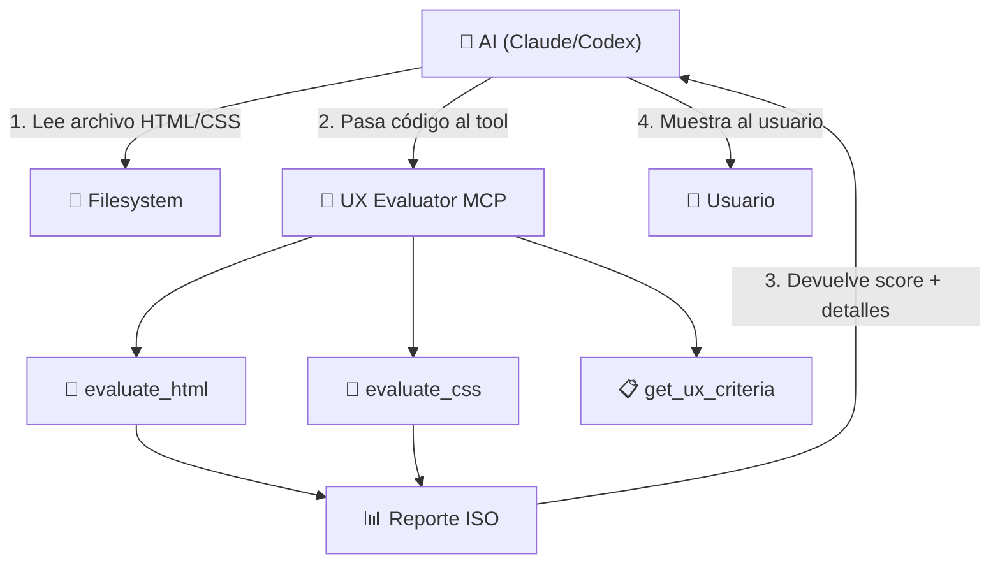

# 🎨 UX Evaluator MCP

Servidor MCP que evalúa código frontend contra normas ISO de UX/Usabilidad.

## 🎯 ¿Por qué este MCP funciona y otros no?

### El problema común ❌
La mayoría de MCPs de "evaluación UX" fallan porque:
1. **No tienen forma de acceder al código** - reciben una URL pero no pueden renderizar ni leer el DOM
2. **No tienen criterios concretos** - dicen "evaluar UX" pero no definen QUÉ medir
3. **No tienen contexto de las normas** - no saben qué dice ISO 9241 en términos verificables

### La solución ✅
Este MCP funciona porque:
1. **Recibe código directamente** - el AI le pasa el HTML/CSS (que ya puede leer del filesystem)
2. **Tiene criterios medibles** - cada regla ISO se traduce a un patrón verificable en código
3. **Expone los criterios como Resource** - el AI puede leer QUÉ va a evaluar

## 📋 Herramientas (Tools)

| Tool | Input | Evaluación |
|------|-------|------------|
| `evaluate_html` | Código HTML | Estructura semántica, accesibilidad, forms, imágenes |
| `evaluate_css` | Código CSS | Responsive, focus styles, design tokens, relative units |
| `get_ux_criteria` | Filtro ISO | Lista de criterios disponibles |

## 🔌 Instalación

```bash
# Build
cd examples/ux-evaluator-mcp
npm install
npm run build

# Agregar a Claude Code
claude mcp add-json ux-evaluator '{"command":"node","args":["./dist/index.js"]}'

# Agregar a Codex
codex mcp add ux-evaluator -- node ./dist/index.js
```

## 💡 Cómo usarlo

Una vez conectado, el AI puede:

```
> Evalúa el archivo index.html contra normas ISO de UX

El AI:
1. Lee el archivo (usando filesystem o su contexto)
2. Llama a evaluate_html con el contenido
3. Recibe el reporte con scores por norma ISO
4. Te muestra los resultados con recomendaciones
```

## 📊 Normas ISO cubiertas

| Norma | Enfoque | Criterios |
|-------|---------|-----------|
| ISO 9241-210 | Diseño centrado en humanos | Responsive, viewport, semántica, touch targets |
| ISO 9241-11 | Usabilidad | Efectividad (feedback), eficiencia (navegación), satisfacción (consistencia) |
| ISO 25010 | Calidad de producto | h1 claro, alt text, contraste, confirmación destructiva |
| ISO 25022 | Calidad en uso | Performance (lazy load), analytics capability |
| ISO 25023 | Métricas internas | Arquitectura de componentes, portabilidad |

## 🏗️ Arquitectura



**Clave**: El AI obtiene el código y se lo pasa al MCP. El MCP NO necesita acceder al filesystem ni a la red.

## 🔒 Seguridad

- Solo recibe strings de código (no ejecuta nada)
- Input limitado a 100KB
- No accede al filesystem
- No hace llamadas de red
- Análisis puramente estático
